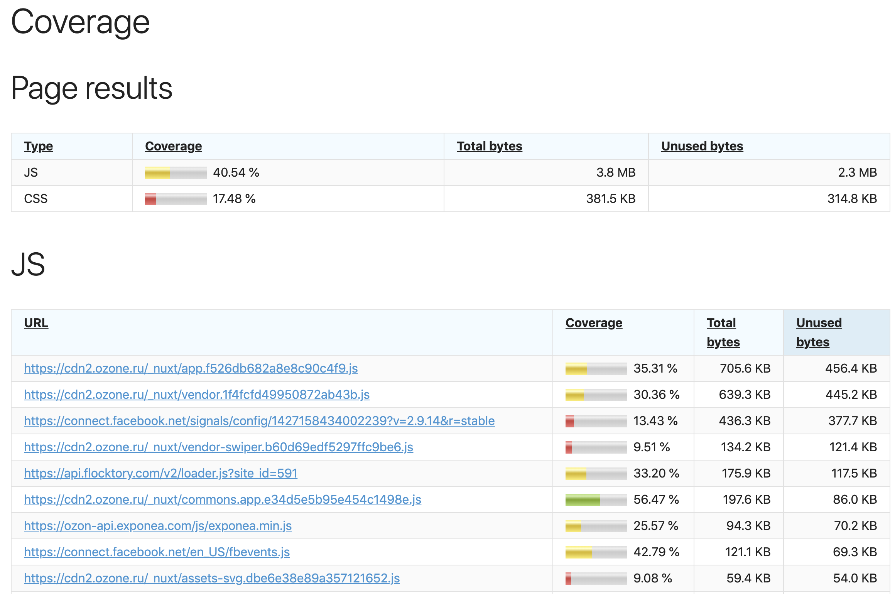

SiteSpeed.io coverage plugin
============================

ABOUT
-----

Run chrome coverage tool, load page, scroll down and get results.



INSTALL
-------

Look at https://www.sitespeed.io/documentation/sitespeed.io/plugins/

HOW TO TEST
-----------

You can create docker image with pre-baket plugin. Like this:

```
FROM sitespeedio/sitespeed.io
ENV SITESPEED_IO_PLUGINS__ADD /sitespeed-coverage

# You need to have git to clone your repo
RUN sudo apt-get update && sudo apt-get install git -y

WORKDIR /sitespeed-coverage
RUN git clone https://github.com/orofarne/sitespeed-coverage.git .

RUN npm install --production

VOLUME /sitespeed.io
WORKDIR /sitespeed.io
```